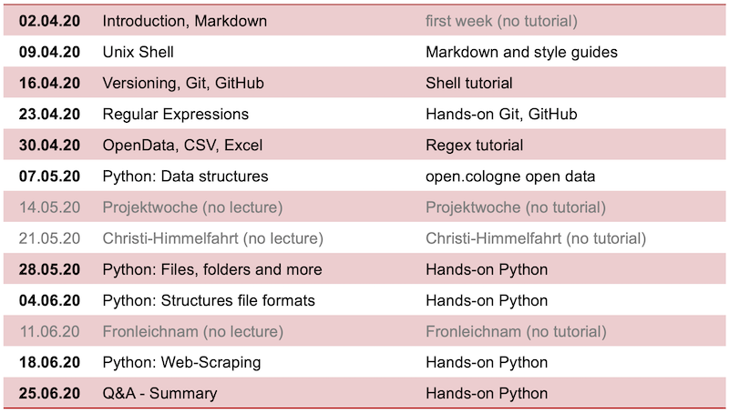

# Data Modeling 2020 (DIS08) 

## Online collaboration with Microsoft Teams

Please join our [Microsoft Teams channel](https://teams.microsoft.com/l/team/19%3a7c8c735f15194ac38727539ef94de964%40thread.tacv2/conversations?groupId=9d9727c3-4f98-4c1e-ab55-0c25274b8364&tenantId=35f8765e-cb47-4d80-afaf-42ff7060fddf). If you are not registered yet, send an email to your [instructor](mailto:philipp.schaer@th-koeln.de). 

## Slides and online lecture archive

Please feel free to comment on all the slides available. Open up a ticket if you find anything I should update or fix. 

The following slide sets are available:

* __01 Introduction, Markdown__ [[pdf](DIS08-01-introduction.pdf)] | [[video](https://youtu.be/RbuWN0Ag-jU)]
* __02 Unix Shell__ [[pdf](DIS08-02-shell.pdf)] | [[video](https://youtu.be/RbuWN0Ag-jU)] | [[setup the shell](https://librarycarpentry.org/lc-shell/setup.html)]

## Assessments

Each week we will release a set of exercises grouped into assessments. 

### Assignment 1

* [GitHub and Markdown](assignment1.md#exercise-1)
* [Unix Shell](assignment1.md#exercise-2)

## Syllabus

The following syllabus is an overview on the topics I plan to cover in this semester. Due to the Corona Crisis all these topics are not fixed. Stay tuned!

